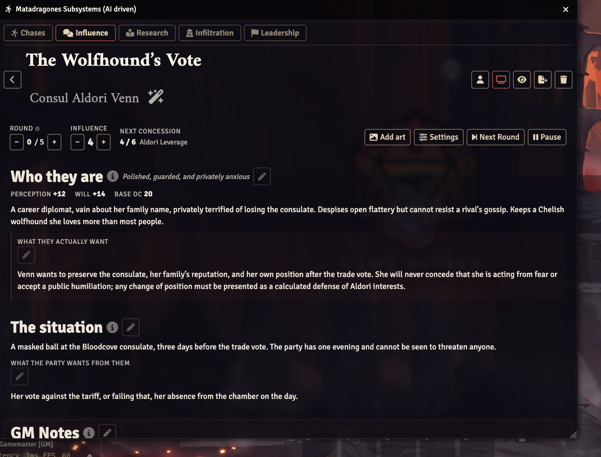
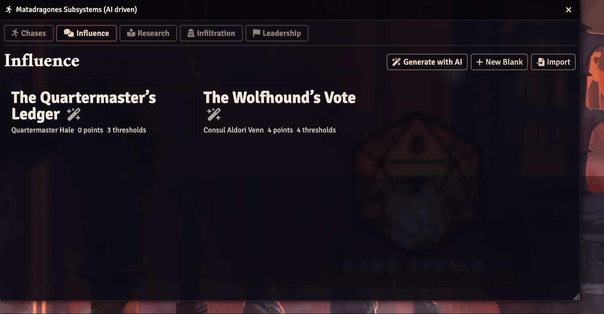
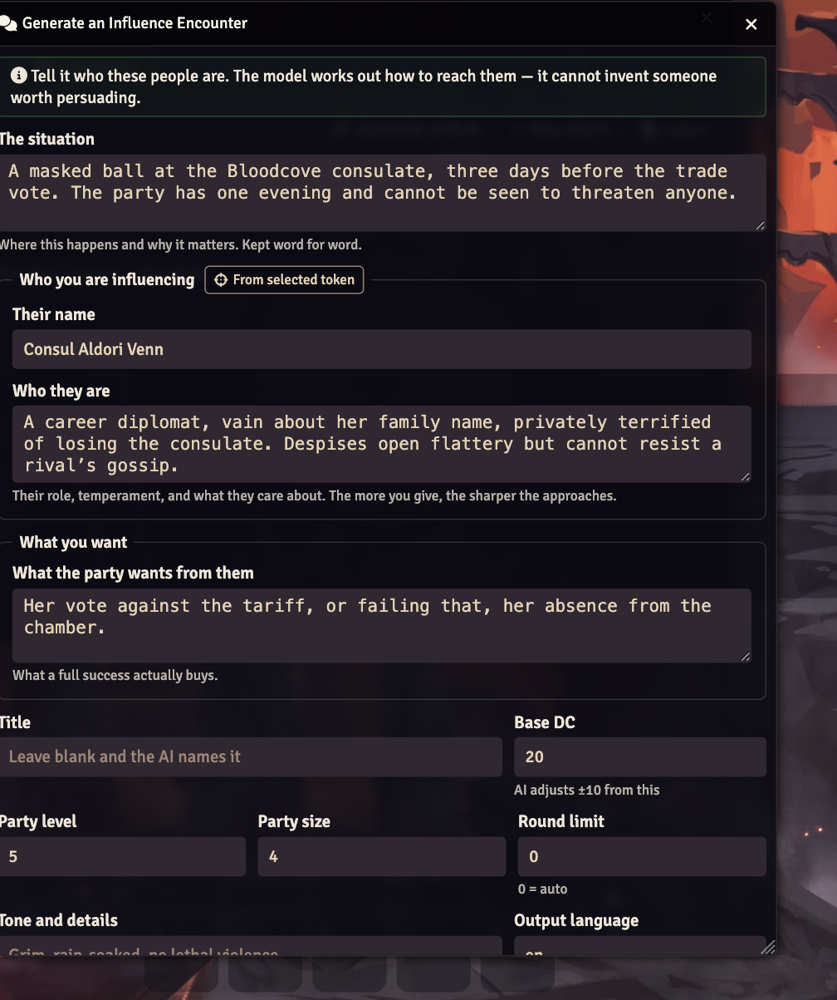
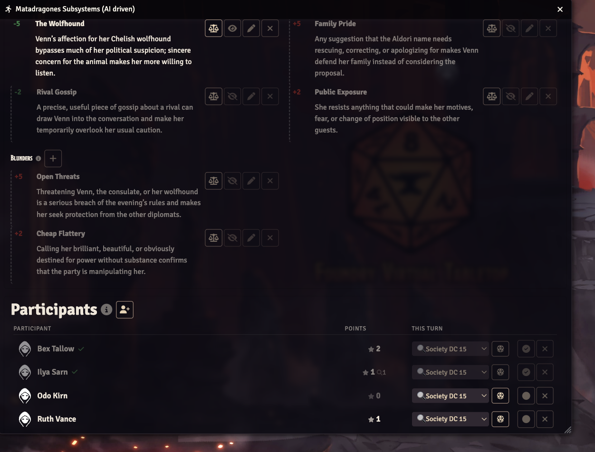
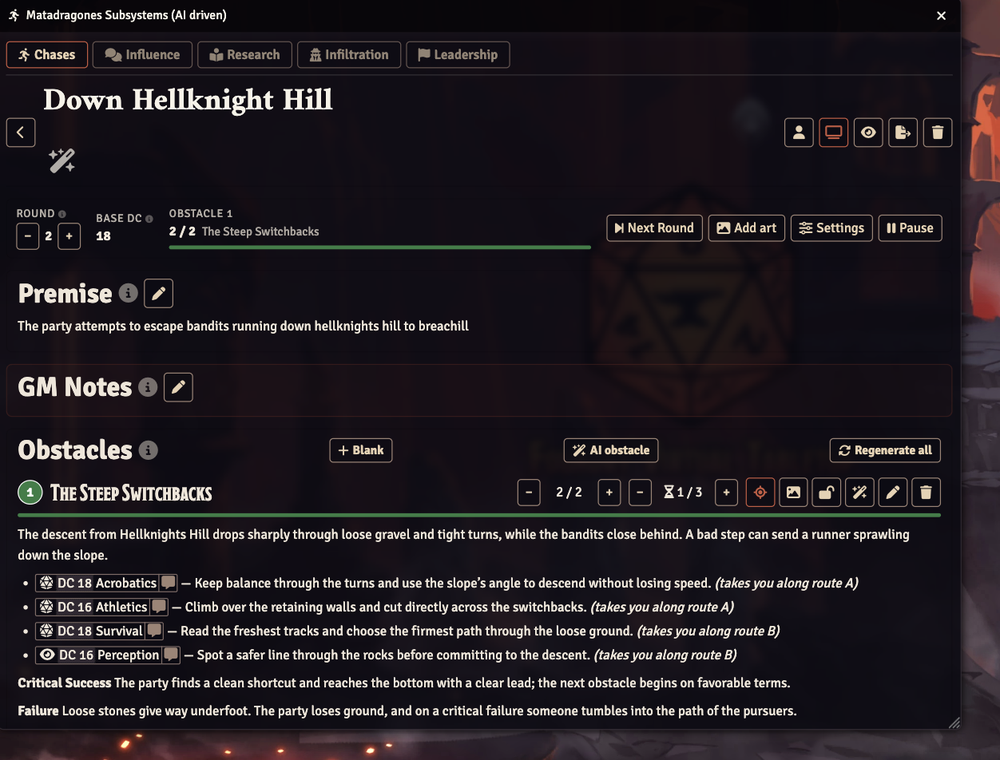
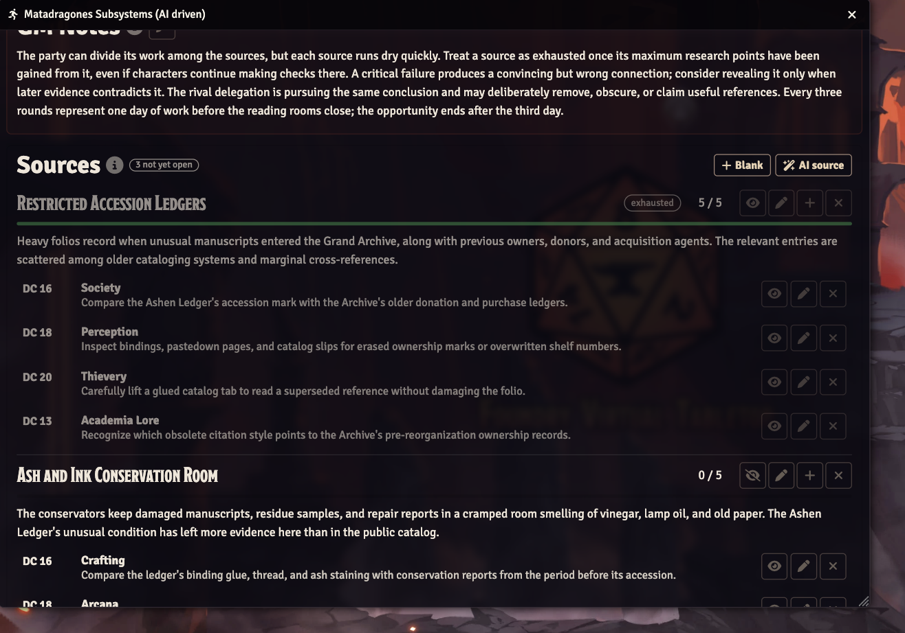
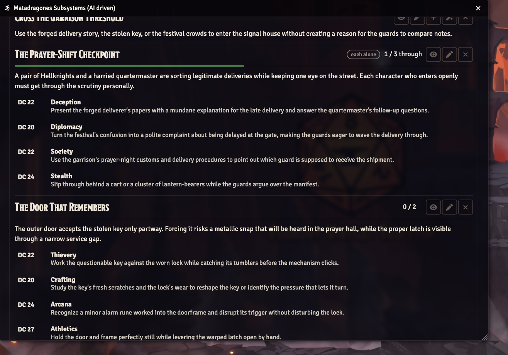
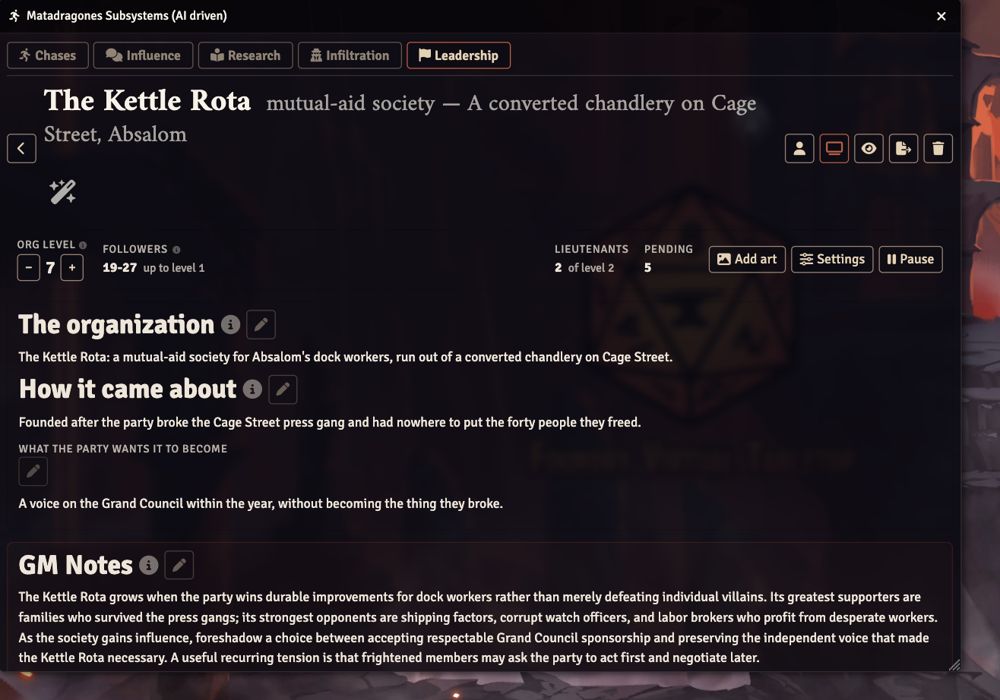
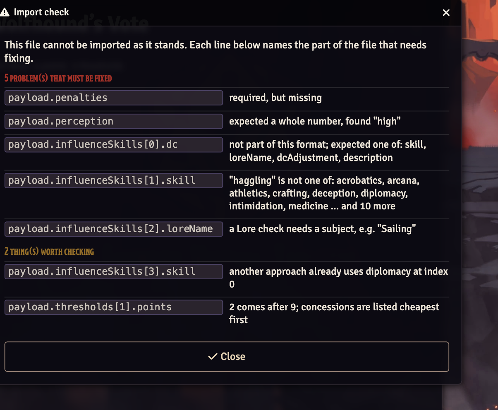

# Matadragones Subsystems (AI driven)

**Run PF2e's five subsystems in Foundry without writing them first.** Describe
the situation in a sentence; get a playable encounter back — obstacles, skill
approaches, DCs, thresholds and clickable inline checks.

<p>
  
  
  
  
</p>



[`pf2e-subsystems`](https://github.com/WBHarry/pf2e-subsystems) gives GMs an
excellent tracker, but every obstacle, DC and skill option has to be typed in
first. This module keeps the tracker and replaces the typing.

**Chases, Influence, Research, Infiltration and Leadership** are all here, and
they all work the same way, so learning one teaches you the rest.



### What it will not do

- **It never invents a DC.** You give a base DC; the model picks a difficulty
  *adjustment* and the module computes `base ± adjustment` from the published
  table. Models are unreliable at recalling PF2e's level-based DCs, so they are
  not asked to.
- **It never rewrites your prose.** The premise, the NPC description and the
  goal are stored exactly as you typed them, and are not in the generation
  schema at all — the model structurally cannot touch them.
- **It never guesses at party maths.** Chase point goals come from the published
  formula, not from the model's sense of what feels right.

### You do not need an OpenAI key

If you would rather not use one, every generate dialog can export a **brief** —
the schema and the prompt — for any agent you like. Fill in its answer and
import it. Same guarantees, no API call. [Jump to that ↓](#bringing-your-own-agent)

## Requirements

- Foundry VTT v13+
- The Pathfinder 2e system (v6+)
- An OpenAI API key

## Setup

1. Install the module and enable it in your world.
2. Open **Settings → Configure Settings → Matadragones Subsystems** and paste
   your OpenAI API key.
3. Optionally pick a model. Defaults to `gpt-5.6-terra`; the **Model override**
   field accepts any model id, so you are not stuck with the dropdown.

Requests go straight from the GM's browser to `api.openai.com`; nothing is
proxied through a third party. If you would rather they did not, point **API
base URL** at your own OpenAI-compatible endpoint.

Because the key lives in the browser rather than the world, each GM enters
their own, once per browser. A second GM on the same world will be asked for
one before they can generate.

## Quick start

A worked example, start to finish. It takes about a minute.

### 1. Open the window

Three ways, whichever suits:

- **Journal sidebar** → the *Matadragones Subsystems* button at the top
- **Scene controls** → Journal Notes layer → the runner icon
- **A macro or the console:**
  ```js
  game.modules.get('matadragones-subsystems-implementation-for-pf2e').api.open();
  ```

### 2. Pick a tab and press Generate with AI

Each tab has the same three buttons: **Generate with AI**, **New Blank** for
writing one by hand, and **Import** for a file.

### 3. Tell it what is going on



Only the prose fields are required. Everything else has a sensible default —
base DC is pre-filled from your party's level, and a blank title means the model
names it.

Note what you are *not* being asked for: no DCs, no skill lists, no point
totals. Those are the module's job.

### 4. You get a playable encounter

Roughly fifteen seconds later. Your premise is at the top, word for word. Below
it: ways to approach the NPC, what each one costs, what they concede as you
wear them down, and — for influence — what will not work on them at all.

Every heading has an **ⓘ**. If you have never run this subsystem before, hover
it and it will tell you what that section is and how it scores.

### 5. Add the party and start rolling

Drag actors from the sidebar onto the participant roster, or use the **+** to
pick from a list. Then press **Start**.



Every row owns its own roll: pick a check from the dropdown, press the die.
Players can roll their own characters from the same row; the result is relayed
to you and applied once. The tally beside each name is what that character has
actually contributed — a critical failure absorbed by the zero floor costs
nobody a point.

The **−/+** beside the total is there for the moment a player says *"can I use
a spell for this?"* — say yes, and award the point by hand.

### 6. Show the players

The screen icon in the header pushes the window onto every player's screen. The
eye toggles whether they can see it at all, and the **preview as player** button
shows you exactly what they see before you commit.

Hidden things stay hidden: GM notes, undiscovered approaches, thresholds they
have not reached. Nothing in this list has ever leaked to a player, and there
is a test that fails if it starts.

## Your API key, and what leaves your machine

The key is stored **in your browser, not in the world**. That distinction
matters: Foundry sends every world setting to every client that joins, so a key
kept in the world is a key every player at your table receives. `restricted:
true` does not prevent that — it only stops players editing the setting. Enter
the key once per browser you GM from, under Configure Settings.

*If you ran a build before 1.0.0, your key was world-scoped. The module deletes
it on load and tells you, but revoke it at platform.openai.com — deleting it
stops it being sent again, it cannot un-send what already went.*

Requests go to `api.openai.com` only, only when a GM asks for something, and
carry: the premise and other prose you typed, the base DC, party level and
size, and for artwork the obstacle text plus any reference images you chose.
Player names, actor sheets and chat are never sent. You are billed by OpenAI
for what you use.

Nothing is gathered on your behalf. Every reference image is one you picked by
hand, which also makes it yours to account for: only send art you hold the
rights to send to a model. The module will not go looking for context in your
world, your compendia or anyone else's assets.

### If the browser is not good enough

Client scope solves one problem completely — no player receives the key — and
does not solve a second one at all: anyone who can use the GM's browser can
read it. That is not a gap this module can close. Its own code runs in that
browser and has to be able to read the key to send it, so any key that unlocked
an encrypted key would sit right beside it. Obfuscation would only mean the key
takes a minute to find instead of a second, while making you believe otherwise.

The real answer is to not put a key in the browser at all:

1. Run a small proxy that holds the real key and forwards to OpenAI, adding the
   `Authorization` header itself. A Cloudflare Worker or a few lines of Express
   is enough.
2. Point **API base URL** at it.
3. Put a token your proxy accepts in the key field — or nothing, if the proxy
   authenticates some other way. Whatever is in the browser is now revocable by
   you and worthless anywhere else.

Short of that, use a **project-scoped key with a spend limit** at OpenAI. A key
that can only ever spend a few dollars on one project fails safe in a way that
a full-account key does not.

The key field is rendered as a password input so it is not read over a shoulder
or caught in a screen share. That is what it is for; it is not encryption and
does not make the stored value any harder to read.

## Chases



The party runs a sequence of obstacles, each needing a number of chase points to
clear. [Rules](https://2e.aonprd.com/Rules.aspx?ID=3049).

**You write the premise. The AI writes the obstacles.**

The premise is the only required input, and it is stored *verbatim* — the model
never rewrites, restates or contradicts it. Everything else is optional:

| Field | Default |
|---|---|
| **Premise** | required; kept word for word |
| **Base DC** | pre-filled from your party's level |
| Title | blank → the AI names it |
| Obstacles | `0` → the AI picks 3–6 |
| Difficulty | Auto → the AI ramps toward the finish |
| Round limit | `0` → the AI decides if a clock suits it |
| Tone, Language | optional |

What you get back:

- Obstacles in order, each with a chase point goal and 2–4 distinct skill options
- Real, clickable PF2e inline checks (`@Check[type:athletics|dc:20]`)
- Critical success and failure outcomes written as fiction, not stat blocks
- GM notes, and a suggested title if you didn't give one

### Regenerating obstacles

Any chase has a **Generate obstacles** button in its Obstacles panel. It reuses
that chase's own premise and base DC, so you can re-roll obstacles you didn't
like without retyping anything — your premise, title and GM notes survive. Write
a premise on a blank chase and use it to fill the chase in from scratch.

The chase title is editable at any time: hover the title and click the pencil.

### Running one obstacle at a time

Obstacles display as a carousel rather than a wall of text. **Players only ever
see one**: the active obstacle. You choose it with the crosshair button (which
also reveals it to them), or leave it unset and it follows the first uncleared
obstacle automatically. As GM you can browse the whole sequence with the arrows
or the numbered dots without changing what players see.

### Showing a chase to the table

The TV icon in a chase's header opens that chase **on every connected player's
screen**, on the active obstacle. If the chase is still hidden it offers to
reveal it first, since otherwise players would get an empty window. If nobody is
connected it says so rather than silently doing nothing.

Foundry does not echo a socket emit back to its sender, so your own window stays
exactly as you left it. On the receiving end the window is un-minimised and
brought to the front, so it cannot open behind something else.

### Previewing the player view

The person icon in the header toggles **Preview as player** — the same window
re-rendered with your GM permissions revoked, so you can check what the table
sees without a second login. If the chase is still hidden it tells you so rather
than showing an empty screen.

### Artwork

Any chase or obstacle can have AI-generated art. **Add art** on a chase, or the
image button on an obstacle, opens a dialog where you write art direction and
attach **reference images**:

- **Selected tokens** — whatever is selected on the canvas
- **Actor** — any actor's portrait or token art
- **File** — anything in your Foundry data directory
- **URL** — an external image

References condition the generated art, so the party actually looks like the
party.

**Art direction is optional.** The chase premise and the *full* obstacle text —
description, every skill approach, and the critical-success and failure outcomes
— are sent automatically, with PF2e inline syntax unwrapped so
`@Check[type:athletics|dc:20]{Athletics}` reads as "Athletics" rather than
leaking markup. That alone is a usable prompt, so you can hit Generate straight
away to see what the fiction produces. Expand *What the model will be told* to
see the exact prompt before spending anything.

### Using art you already have

Prepared images before the session? **Browse or upload** in the same dialog picks
a file from your Foundry data or uploads a new one and attaches it as-is, with no
generation and no API call.

References are converted to PNG before upload, since Foundry ships SVG icons and
the images endpoint only accepts png/jpeg/webp. Generated images are saved to
`worlds/<world>/matadragones-subsystems-implementation-for-pf2e/` — never inlined as base64
into the world database, which would bloat it badly.

An external URL only works if that host sends permissive CORS headers. When one
cannot be loaded the module says which, and generates without it rather than
failing the whole request.

The generated chase starts **hidden**, with only the first obstacle unlocked.
Reveal it when you're ready.

### You own the DCs

The model never picks a number. **You** set one base DC for the whole chase; the
model only chooses a *difficulty adjustment* per skill option (`easy`,
`standard`, `hard`, …) and the module computes `baseDC + adjustment`, a range of
±10. So a base of 20 yields DC 18 for an easy approach and DC 22 for a hard one.

The dialog pre-fills the base DC from your party's level using the GM Core
level-based DC table, but it is yours to override — which also means regenerating
obstacles later keeps the same difficulty footing.

The inline-check syntax is likewise assembled in code, not by the model: one bad
token would otherwise produce a dead link.

### Players roll for themselves

Once a round is underway, each participant row shows a skill picker and a **Roll**
button — but only to the user who **owns that actor**. Everyone else sees "not
yours". Rolling:

1. Rolls the real PF2e check (`actor.getStatistic(slug).roll({dc})`), so
   modifiers, the check dialog and the chat card all behave normally
2. Converts the degree of success to chase points — critical success **+2**,
   success **+1**, failure **0**, critical failure **−1**, never below zero
3. Marks that participant as having **acted this round**, so they cannot roll again
   until the GM advances the round

World settings are GM-writable only, so a player's result is relayed over the
socket and applied by exactly one GM client — the designated `activeGM`, which is
what stops two GMs double-counting the same roll.

### The GM stays in control

Two overrides sit on every participant row, GM only:

- **Roll for anyone.** A GM can roll any participant with a linked actor, including
  one who has already acted — the button reads *Roll again* so it is never an
  accident. Useful when a player is away from the table.
- **Award or remove a success.** The `−` and `+` beside the tally hand a
  participant a chase point, or take one back, with no dice involved. This is the
  "she casts a spell to clear the gap" case.

An award is credited to that participant exactly like a roll, so the tally stays
honest, but it does **not** count as a roll in their hit rate and does **not**
consume their action for the round. It also works for participants with no linked
actor, who cannot roll at all.

### Who is carrying the chase

Every participant row shows a running tally, **visible to players as well as the
GM**: chase points contributed to the current obstacle, and to the chase overall.
Hovering shows their hit rate — successful rolls out of rolls made.

The tally credits what the obstacle *actually moved*, not the nominal points. A
critical failure absorbed by the zero floor costs nobody a point, so the numbers
across all participants always add up to the obstacle's real progress.

> Preview-as-player is **not** a reliable test of the ownership gate: a GM owns
> every actor, so the preview always shows roll buttons. To check what a specific
> player can roll, log in as them.

### Obstacle round allowances

Each obstacle carries its own round budget alongside the chase-wide one. **Next
Round** ticks both — the chase counter and the active obstacle's. When an
obstacle runs out it is flagged *out of rounds*; nothing happens automatically,
because what failure costs is a fiction call only the GM can make.

### How many successes an obstacle needs

Chase point goals are **not** the model's to choose. They come from the published
formula: half the obstacles need one point fewer than the party size, half need
two fewer, minimum 1. Alternating by position is what makes it half and half.

| Party | Goals |
|---|---|
| 4 | 3, 2, 3, 2, … |
| 5 | 4, 3, 4, 3, … |
| 6 | 5, 4, 5, 4, … |
| 2 or fewer | 1 throughout |

Party size comes from the active party actor. Goals are set when an obstacle is
generated, so chases made earlier keep whatever numbers they had — edit them by
hand if you want them re-based.

### Forks in the route

A fork is chosen by **how you tackled the previous step**, so the topology is:

```
   1  ──Athletics──▶  2A  ──▶  3A
      ──Stealth───▶  2B  ──▶  3B
      ──Deception─▶  2C  ──▶  3A
```

- **Step 1 never forks.** Nothing precedes it, so nothing could route into it.
- Rolls at step 1 choose between `2A` / `2B` / `2C`.
- If step 3 also forks, then `2A`, `2B` and `2C` each need approaches routing
  into `3A` / `3B` / `3C`.
- On the **last step** every approach ends the chase, so there is nothing to
  choose.

The roll picker states the destination plainly, and only a **success** commits
you — botching the climb does not put you on the rooftops:

```
Acrobatics DC 18 → A
Athletics  DC 16 → B
Survival   DC 18
Perception DC 16
```

A participant always rolls against **their own fork**, even while the GM is
looking at another one, so half the party can take the rooftops and half the
sewers in the same round.

Two ways to fork a step, on that obstacle's toolbar (hidden on step 1):

- **Fork (blank)** — adds an empty alternative you write yourself
- **Fork (AI)** — generates a contrasting alternative *and* routes the preceding
  step's approaches across the resulting branches

### Editing where a roll leads

**Edit obstacle** (the pencil) lists every approach with its DC, its description,
and a **Leads to** column:

| Approach | DC | What the character does | Leads to |
|---|---|---|---|
| Athletics | 16 | Climb the retaining wall | `2A — Rooftops` |
| Stealth | 18 | Slip into the drain | `2B — Sewers` |

The column adapts to the topology: a dropdown when the next step forks, *"The
next step"* when it does not, and *"Ends the chase"* on the final step. Any
approach that leads nowhere is flagged on the obstacle card with a count, so a
dead end cannot go unnoticed.

### Filling obstacles in

Every obstacle has an **AI wand** on its toolbar that fills or replaces its
contents in place, keeping its position, branch, lock state and artwork. That is
how a blank obstacle or a blank fork gets populated. Replacing written content
asks first; filling a blank one does not.

At chase level the two are separate buttons so it is never ambiguous which you
are getting: **Blank** adds an empty obstacle, **AI obstacle** generates one that
follows on from the others.

### Running a chase

The GM controls everything; players get a read-only view that hides unrevealed
obstacles and all GM notes. Updates reach players automatically through
Foundry's world-setting broadcast — no socket handshake, no refresh.

- **+ / −** on an obstacle adjusts chase points (success = 1, crit = 2)
- The **lock** icon reveals an obstacle to players
- **Next Round** advances the counter and clears everyone's "acted" flag
- **Add participants** pulls in selected tokens, or the whole active party
- Or **drag actors straight onto the roster** from the sidebar. Dropping an
  actor folder adds everyone in it. Actors already in the chase are skipped
  rather than duplicated, and anything that is not an actor is refused with a
  message. ApplicationV2 ships no drag-drop support of its own, so this is wired
  by hand in `_onRender`.

Chases export and import as JSON, so you can share a generated one or keep it
between worlds.

## Influence


The second subsystem, on its own tab. [Rules](https://2e.aonprd.com/Rules.aspx?ID=3040).

One encounter is one person to win over — the published subsystem is a stat
block per NPC, so a gala with three targets is three encounters.

### Generating one

The model cannot invent someone worth persuading, so the dialog asks for the
things only you know, and stores them verbatim:

| You provide | Example |
|---|---|
| **The situation** | A masked ball at the Bloodcove consulate, three days before the trade vote |
| **Their name** | Consul Aldori Venn |
| **Who they are** | A career diplomat, vain about her family name, privately terrified of losing the consulate |
| **What you want** | Her vote against the tariff, or failing that, her absence from the chamber |

**From selected token** fills the name and description straight from an actor's
biography. Everything else — base DC, party level and size — is pre-filled.

The model returns the Perception and Will modifiers, discovery checks and what
each reveals, ways to win them over, ascending concession thresholds, and their
soft spots, resistances and blunders.

### Playing one

- **Discovery** checks reveal, they do not score. A success uncovers the cheapest
  thing still hidden — the easiest approach first, then a soft spot, then a
  resistance — and a critical success uncovers two.
- **Influence** checks score: success 1 point, critical success 2, critical
  failure −1, never below zero.
- **Thresholds** reveal themselves as the points reach them.
- **Soft spots, resistances and blunders** shift every DC once you put them in
  play with the scales button. Minor ones move it by 2, strong ones by 5, and the
  current total shows in the status bar. Every listed DC updates live.
- **Rolling works exactly as in chases**: each participant row carries a picker
  of every check available to them and a Roll button. Discovery entries are
  marked with a magnifier, since the two score differently. The GM can roll for
  anyone, including someone who has already acted, and can award or remove
  influence points on a participant's behalf with the `−` / `+` beside their
  tally — the spell-and-hero-point case, credited but not counted as a roll.

Players see only what has been discovered. The GM sees everything, marked, with
a count of what is still hidden. In the GM's roll picker an approach the party
has not unlocked is prefixed with a padlock, so rolling one is never an accident.

### Letting an encounter open up

A conversation should not show all its cards at the start. Any approach can
carry an **Unlocks at** point total: it stays hidden until the party's influence
reaches it, then surfaces on its own with a notice. Hidden approaches that will
unlock are badged `🔒 unlocks at 5`, which reads differently from one that is
merely undiscovered.

Both lists — Discovery and Ways to win them over — have **Blank** and **AI
approach** buttons, so you can grow an encounter mid-session. The AI option is
told what already exists so it does not repeat itself, is told how far the party
has got so a later approach reads like a conversation that has warmed, and
defaults its unlock point to the next concession.

Each approach has a pencil for its name, statistic, DC, description, what it
reveals, and its unlock point.

### Editing everything else

Every authored section carries a pencil: the situation, who they are, **what
they actually want** (GM-only), what the party wants, and GM notes. The slider
icon on the stat block edits the name, disposition, Perception, Will, base DC,
round limit, party size and level.

Concessions and the three modifier lists can each be added to, edited and
removed. Each list has an **ⓘ** explaining what it does, because "soft spot",
"resistance" and "blunder" are not self-evident:

> **Soft spots** — lowers every influence DC once in play, by 2 for a minor one
> or 5 for a major one.
> **Resistances** — raises every DC; something they *are*.
> **Blunders** — raises every DC; something the party *did*.

### Nothing hidden is rollable

The roll picker offers only what the GM has put in play — for everyone,
including the GM. A GM still sees hidden entries in the lists and reveals them
with the eye icon, at which point they become rollable. A roll can never get
ahead of what the party has been shown.

## Research



The third subsystem. [Rules](https://2e.aonprd.com/Rules.aspx?ID=3045).

### Generating one

Same contract as the others — you supply what the model cannot invent, and it is
stored verbatim:

| You provide | Example |
|---|---|
| **What they are researching** | The provenance of the Ashen Ledger, and who last held it |
| **The situation** | Three days in the Grand Archive of Absalom, while a rival delegation works the same shelves |
| **What it buys them** | The name of the ledger's last owner, and where they were buried |

The model returns sources, the checks inside each, ascending findings, and
complications.

### Sources have caps

This is the shape that makes Research different. Points come from **sources** —
a library wing, an archive, an informant — and each caps how much can be taken
from it. That cap is what stops a party grinding one shelf forever, so it lives
on the source rather than the checks under it.

A roll that would exceed the cap yields only the remainder and says so; once a
source is at its cap it is marked **exhausted**, drops out of the roll picker,
and refuses further rolls. The status bar shows **Left to find** — the total
still obtainable — so you can see at a glance if the research has become
unwinnable and needs another source opened.

### Complications fire on points or time

Each complication carries a trigger: a research point total, or a number of
rounds elapsed. Both are checked wherever those numbers move — a roll, an award,
the manual steppers, Next Round — so a GM adjusting either by hand still gets the
interruption. A complication can carry an ongoing DC shift that applies to every
check while it is in play.

Rounds carry a unit (`hour`, `day`) because the rules put one round anywhere from
ten minutes to a full day.

### Everything else is as you would expect

Sources, their checks, findings and complications can each be added by hand or —
for sources — generated, then edited and removed. Checks and sources can carry an
unlock point so the work opens up as it advances. Participants roll from their
row, drag in from the sidebar, and carry a contribution tally. The header has the
same six operations as the other subsystems.

## Infiltration



The fourth subsystem. [Rules](https://2e.aonprd.com/Rules.aspx?ID=3059).

### Awareness is the clock

This is what makes Infiltration different from the other three. A failed check
costs no progress — it costs **secrecy**:

| | Infiltration points | Awareness |
|---|---|---|
| Critical success | +2 | — |
| Success | +1 | — |
| Failure | 0 | **+1** |
| Critical failure | 0 | **+2** |
| End of every round | — | **+1** |

Awareness breakpoints fire for good once passed and usually raise every DC. Only
the **highest** one passed applies, not the sum. The status bar shows the current
total against the next breakpoint, so you always know how much rope is left.

### Complications take over

A fired complication stops everything. The view shows a banner, the panel turns
red, and the roll picker offers **only** that complication's checks until it is
dealt with — a roll against anything else is refused. They fire at an awareness
total, after so many rounds, or when you call for it.

### Edge points

Earned from **preparations** before the job — bribe a lamplighter, forge a writ.
Mark one with `+` when it succeeds to award the point. Spending one treats the
selected check as a success **and takes back the awareness that failure drew**,
which is what "as if they had succeeded" has to mean here.

### Objectives, obstacles, opportunities

Objectives are the stages: get inside, reach the room, get out. Each holds
obstacles needing infiltration points. An obstacle can be **individual** — every
character must get past it themselves, and the tally counts people through
rather than points scored.

Opportunities are optional risks paying off in something other than progress, and
never block anything.

## Leadership



The fifth subsystem, and the one that least resembles the rest.
[Rules](https://2e.aonprd.com/Rules.aspx?ID=1258).

### There is no point track

The published subsystem is explicit that an organisation has no meter to fill.
It gains levels because the party earned them in play, so **you nudge the level
yourself** — that is the track. Everything else follows from it.

The size bar is the published table, not a formula: at organisation level 9 the
Lamplighters have 37–53 followers of up to level 1, and 4–5 lieutenants of level
2–3. Followers never come adventuring and provide no free labour or resources,
and the generator is told so.

### What happens

Downtime events come in the published three kinds, colour-coded:

- **Opportunity** — a decision that shapes the organisation
- **Trouble** — something needing the party, which should cost less than it gives
- **Windfall** — an unexpected benefit

Each carries a level it surfaces at, so an organisation opens up as it grows. An
event can carry checks; a success settles it and is credited to whoever rolled.
Those checks are a light extension rather than published rules — a Trouble
usually wants a roll, and having one keeps the roll experience identical to the
other four.

### What it does not have

No rounds and no point awards, both waived explicitly in the parity audit with
reasons, because inventing them would misrepresent the subsystem.

## Bringing your own agent

You do not have to spend an OpenAI call here. Every generate dialog has **Save
brief** beside its Generate button: fill the form in as usual, and instead of
sending the request the module writes out a JSON file containing

- the prose you wrote, under `given`, which is yours and stays yours;
- the exact system and user prompts this module would have sent;
- the full JSON Schema the answer has to match;
- an empty `payload` for the answer to go in.

Hand that to whatever agent you like. Put its answer in `payload`, change
`"kind"` from `"brief"` to `"payload"`, and use **Import**. The file goes
through the same mapping an OpenAI answer does, so the guarantees are the same
ones: **the agent never writes a DC.** It picks a `dcAdjustment` per check and
the module computes `baseDC + adjustment` from the number in `given`, because a
model asked for a level-based DC will confidently get it wrong. Inline check
syntax is likewise built here, not pasted in.

### The import check

Import verifies before it stores, and tells you where the problem is rather than
refusing the whole file:



```
5 problem(s) that must be fixed
  payload.penalties                 required, but missing
  payload.perception                expected a whole number, found "high"
  payload.influenceSkills[0].dc     not part of this format; expected one of:
                                    skill, loreName, dcAdjustment, description
  payload.influenceSkills[1].skill  "haggling" is not one of: acrobatics, arcana …
  payload.influenceSkills[2].loreName  a Lore check needs a subject, e.g. "Sailing"

2 thing(s) worth checking
  payload.influenceSkills[3].skill  another approach already uses diplomacy at index 0
  payload.thresholds[1].points      2 comes after 9; concessions are listed cheapest first
```

Errors stop the import. Warnings do not — they offer **Import anyway**, because
a GM may well have meant it.

The checks go past the schema to the things that make content unplayable at the
table: research whose sources cannot between them reach the last finding, an
objective with no obstacles, a Lore check with no subject, a leadership event
that surfaces above level 20, fewer approaches than there are characters. Those
are worth catching, because each of them type-checks perfectly and still ruins a
session.

A file exported with the **Export** button is a third shape — an event that has
already been through the mapping — and still imports, so backups keep working.

## Fidelity to the published rules

Checked against [Chases (GM Core)](https://2e.aonprd.com/Rules.aspx?ID=3049).

**Followed as written**

- Chase points are tracked **per obstacle**, never chase-wide. The rules are
  explicit that "Chase Points represent the ability of the whole group to bypass
  the obstacle", so there is no chase-wide pool. The status bar mirrors the
  obstacle currently in play rather than inventing a total.
- Degrees of success: critical success **+2**, success **+1**, critical failure
  **−1**.
- The GM's *award a success* button is the rules' spell/automatic assistance
  (**+1**, or **+2** if extremely helpful — click twice).

**Deliberate house rules**

| Rule | Published | Here |
|---|---|---|
| Round limits | None — rounds continue until the obstacle is overcome | Optional chase-wide limit, plus a per-obstacle allowance |

- Passing: "A character who passes their turn or is unable to act automatically
  causes the group to lose 1 Chase Point." The **Pass** button on a participant
  row does exactly this. It costs the group a point, marks the turn spent, and is
  credited against that participant — but does not count as a roll, so it never
  distorts their hit rate.

**Deliberate additions**

- Forked steps (`2A` / `2B`) are not in the published subsystem, which assumes a
  single line of obstacles. They are additive: a chase with no forks behaves
  exactly as written.

## Architecture

```
scripts/
  constants.js                 module id, settings keys, DC tables, skill list
  settings.js                  setting registration; re-renders open views on change
  helpers.js                   store access, DC maths, inline-check HTML building
  data/chase.js                Chase / Chases DataModels
  socket.js                    push-to-players and roll-relay messaging
  rolls.js                     PF2e check rolling and result application
  migrate.js                   backfills older chases to the current schema
  ai/openai.js                 chat completions + Structured Outputs client
  ai/image.js                  image generation, reference loading, file saving
  ai/chase.js                  chase + obstacles-only schemas, prompts, mapping
  ai/influence.js              influence schema, prompt, mapping
  ai/research.js               research schema, prompt, mapping
  ai/infiltration.js           infiltration schema, prompt, mapping
  ai/leadership.js             leadership schema, prompt, mapping
  exchange.js                  briefs out, agent payloads in, and the verifier
  data/influence.js            Influence / Influences DataModels
  data/research.js             Research / Researches DataModels
  data/infiltration.js         Infiltration / Infiltrations DataModels
  data/leadership.js           Leadership / Leaderships DataModels
  subsystems.js                registry: storage + shared GM operations
  apps/subsystem-view.js       the GM/player window
  apps/generate-chase-dialog.js the generation form
```

All state lives in one world setting (`chases`) holding an id-keyed map. Adding a
subsystem means a new DataModel, a new setting in the same shape, a schema +
prompt under `ai/`, and a branch in the view.

## Tests

```
npm install
npm test
```

Three harnesses, no Foundry required — they stub the globals:

- `check-logic.mjs` — DC maths against the published table, HTML escaping,
  inline-check composition, model-payload mapping, and the Structured Outputs
  strict-mode invariants (`additionalProperties: false`, every property required)
- `check-openai.mjs` — request shape, model override precedence, and every error
  path (missing key, HTTP error, refusal, malformed JSON, abort)
- `check-templates.mjs` — compiles and renders every template, asserts the player
  view omits GM controls and GM notes, and checks that every action button
  carries the ids its handler reads (a button with a missing id is a silent no-op)
- `check-imports.mjs` — verifies every named import resolves to a real export. A
  dangling import breaks the whole ES module graph at load time, and Foundry
  reports only an inactive module with no obvious cause

## Known limits

- A GM must be connected for player rolls to be recorded; the module says so
  rather than dropping the result silently.
- The premise and GM notes editors are plain textareas, not ProseMirror.
- **Temperature** is a free-text field rather than a number input. Foundry's
  settings form submits an empty number input as `NaN`, which no nullable
  `NumberField` can validate, so a blank field would break the whole sheet.
  Blank means "omit the parameter".
- Only the Chase subsystem is implemented.

## Licence and attribution

The code is MIT; see [LICENSE](LICENSE).

The Pathfinder Second Edition rules this module implements are Paizo's, not
mine. Mechanical rules content is used under the ORC License, and the
Pathfinder name under Paizo's Community Use Policy. This module is free,
cannot be sold under that policy, and is not published, endorsed or approved by
Paizo. The full attributions are in [NOTICE.md](NOTICE.md).

No adventure text, artwork or stat blocks from any Paizo publication ship with
this module. What it produces is generated at runtime from your own writing.
